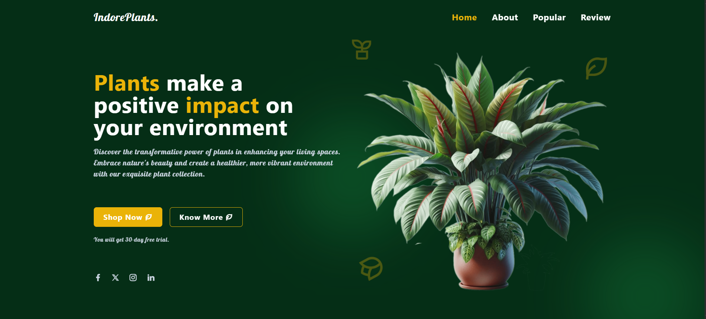
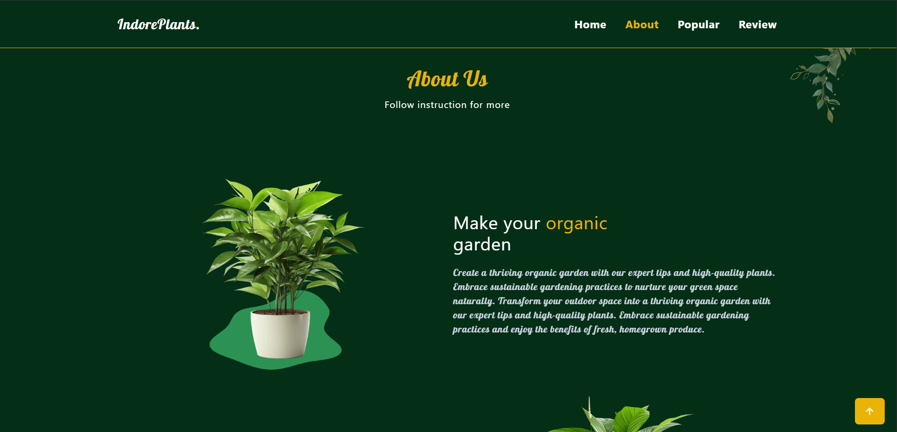
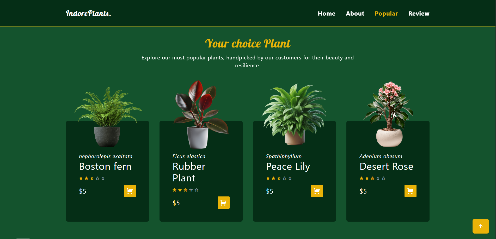

<!-- ========================================================= -->
<!-- ===================== IND O R E P L A N T S ===================== -->
<!-- ========================================================= -->

<p align="center">
  
</p>

<h1 align="center">
  🌿 I N D O R E&nbsp;&nbsp;P L A N T S
</h1>

<p align="center">
  <b>A Nature-Inspired • Modern • Fully Responsive Plant Website</b>
</p>

<p align="center">
  Crafted with <b>Tailwind CSS</b> & <b>Vanilla JavaScript</b><br/>
  Designed with <b>layout thinking</b>, <b>UI discipline</b> & <b>real-world structure</b>
</p>

<p align="center">
  ───── 🌱 ─────
</p>

<p align="center">
  <strong>
    Mobile-First &nbsp;•&nbsp;
    Grid + Flexbox &nbsp;•&nbsp;
    Scroll Animations &nbsp;•&nbsp;
    Swiper Slider
  </strong>
</p>

   
<br/>

<p align="center">
  
  
  
</p>

<p align="center">
  
  
  
</p>

<p align="center">
  ───── 🌿 ─────
</p>

---

## 🌱 What is this Project?

> **IndorePlants** is a **realistic front-end project** that simulates how a modern plant & gardening website should look, behave, and scale in the real world.

This project was built to go **beyond visuals** and focus on:

- 🧠 **Layout decision-making**
- 📐 **Proper Grid + Flexbox usage**
- 📱 **Mobile-first responsiveness**
- 🎞️ **Smooth user interactions**
- 🧩 **Clean, maintainable structure**

If someone asks:  
> *“Do you actually understand frontend layout & UI?”*  
This project is the answer.

---

## 👀 Visual Sections (Real Screens, Real UI)

### 🖥️ Home Section


### 🌱 About Section


### 🪴 Popular Plants


> These are **actual screenshots** from the project — no mockups, no fake demos.

---

## 🚀 Why this Project Matters

Most beginner projects:
- Look okay ❌
- Break on different screens ❌
- Have no layout logic ❌

**IndorePlants was built differently**:

✔ Layout planned before CSS  
✔ Grid for structure, Flex for alignment  
✔ Components designed like a real product  
✔ Animations added with purpose, not noise  

This is how **production-style front-end** is built.

---

## ✨ Core Features (No Fluff)

### 📱 Fully Responsive
- Mobile → Tablet → Desktop
- No overflow bugs
- No broken sections

### 🎨 Tailwind CSS Workflow
- Utility-first styling
- Consistent spacing & colors
- Zero CSS bloat

### 🧭 Smart Navigation
- Mobile hamburger menu
- Smooth open / close
- Active link highlight on scroll

### 💬 Customer Review Slider
- Powered by **Swiper.js**
- Auto-play enabled
- Touch & mouse swipe
- Pagination support
- Responsive slides:
  - 📱 1 slide
  - 💻 2 slides
  - 🖥️ 3 slides

### ✨ Scroll Animations
- Powered by **ScrollReveal.js**
- Direction-based reveals
- Smooth & performance-friendly

---

## 🧠 Tech Stack

| Technology | Role |
|-----------|------|
| **HTML5** | Semantic structure |
| **Tailwind CSS** | Styling & responsiveness |
| **JavaScript** | Interactivity & logic |
| **Swiper.js** | Review carousel |
| **ScrollReveal.js** | Scroll animations |
| **Remix Icons** | Icon system |

---

## 📐 Layout Thinking (IMPORTANT)

This project strictly follows:

🧱 **Grid** → Page & section skeleton  
🧲 **Flexbox** → Alignment & components  
⚡ **Utility CSS** → Fast, scalable styling  

This separation keeps the UI:
- Clean
- Predictable
- Easy to scale

---

## 📱 Responsive Logic

**Breakpoints used:**

- `sm` → Mobile 📱  
- `md` → Tablet 📟  
- `lg` → Laptop 💻  
- `xl` → Desktop 🖥️  

**Swiper config:**
```js
breakpoints: {
  640: { slidesPerView: 1 },
  768: { slidesPerView: 2 },
  1024:{ slidesPerView: 3 },
}
```
<!-- ===================== AUTHOR : MAIN CHARACTER ARC ===================== -->

<p align="center">
  ━━━━━━━━━━━ ✦ ✧ ✦ ━━━━━━━━━━━
</p>

<h2 align="center">👨‍💻 THE CREATOR</h2>

<h3 align="center">
  🌱 <strong>PANKAJ GOUR</strong>
</h3>

<p align="center">
  <em>
    Front-End Developer • UI Architect • Layout Thinker
  </em>
</p>


---

### 🧠 Origin Story

 

I learned front-end development by **breaking layouts**,  
**fixing responsiveness**,  
and **rebuilding UI until it felt right**.

This project is a result of that mindset.

---

### ⚔️ Skill Arsenal

- 🧱 **Grid & Flexbox** — layout before decoration  
- 📱 **Responsive Design** — mobile-first, always  
- 🎨 **Tailwind CSS** — utility-driven, scalable styling  
- ⚙️ **Vanilla JavaScript** — no shortcuts, real logic  
- ✨ **UI Motion** — subtle, purposeful animations  


---


## 🎯 I focus on:
- structure over noise  
- clarity over complexity  
- intent over imitation  

---

### 🌍 Coordinates

📧 **Email:** [Pankajgour5000@gmail.com](mailto:Pankajgour5000@gmail.com)  
🌏 **Base:** India  
🎯 **Role:** Front-End Developer  

---

<p align="center">
  <strong>
    「 This is not the final form. 」
  </strong>
</p>

<p align="center">
  ━━━━━━━━━━━ ✦ ✧ ✦ ━━━━━━━━━━━
</p>

<!-- ===================== END OF ARC ===================== -->
